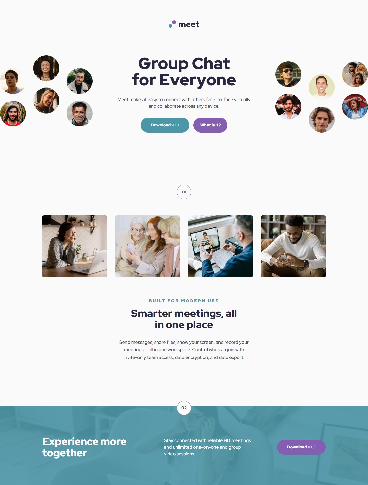

## Frontend Mentor Challenge 13 - Meet Landing Page

This is my solution to the [Meet Landing Page](https://www.frontendmentor.io/challenges/meet-landing-page-rbTDS6OUR) challenge on [Frontend Mentor](https://www.frontendmentor.io/).

### Screenshots of the Solution (Desktop & Mobile). 🔍




#

### Links. 🔗

- Live Site URL: https://meet-landing-page-darkstarxdd.vercel.app/

#

### Built with. 🔨

- HTML & CSS.
- Vite.
- Mobile first approach.

#

### Features. ✨

- Converted the JPG images in the middle of the page to WebP format for better performance.
- Self-hosted fonts for faster loading.

#

### Testing and Accessibility. 🧪

- Used the Responsively App to check the site's appearance on various screen sizes, from 320x480 to 3000x2000.
- Set the browser font size on desktop to various values ranging from 9px to 56px to ensure everything on the site scales properly with the user's preferred browser font size.
- Zoomed the page in and out using Ctrl + Scroll wheel (up to 500%).
- Tested with the NVDA screen reader.
- Viewed the site on an iPhone 11 in both portrait and landscape modes.
- Performed Lighthouse and PageSpeed tests. ([PageSpeed Result.](https://pagespeed.web.dev/analysis/https-meet-landing-page-darkstarxdd-vercel-app/xt2jb9k7it?form_factor=mobile))

#

### Problems Faced. 🚧

- The hero image at the top was a bit tricky. On mobile layout it’s one image. But on the desktop layout it’s two separate images. To achieve that result i used two `<picture>` elements. Both picture elements have the mobile version of the image as the default image. Then, one picture element has the left desktop image as the `srcset` while the other picture element has the right desktop image as the `srcset`.

  Since mobile image is the default for both picture elements, one picture element is hidden on mobile screen using `display: none`. Only one is visible. When the screen is on desktop sizing, both picture elements will be visible and both will be switched to the image defined in their respective `srcsets`. Giving the required result. Below is a simplified version of the code.

  ```html
  <picture class="picture-left">
    <source
      media="(min-width: 80rem)"
      srcset="/assets/images/desktop/image-hero-left.png"
    />
    
  </picture>

  <div class="hero-content">...content</div>

  <picture class="picture-right">
    <source
      media="(min-width: 80rem)"
      srcset="/assets/images/desktop/image-hero-right.png"
    />
    
  </picture>
  ```

- On the design file there was an overflow effect on the hero image, i struggled a lot to achieve it, and with some help managed to get it to a working state. But in the end i ended up not using it. I liked the current solution without any overflowing effect on the image.

#

### Ending Notes 📝

- Nothing completely new was learned but this project gave me some good experience considering this had a fair amount of elements. Up until now most of the projects i have done were component projects or coming soon pages with a far less number of elements than this. So this was a good opportunity to apply and practice the things i have been learning so far.
- Used a negative margin to position the overlapping number 2 at the bottom.
- Used a pseudo element to get the overlay color on section 2. Initially i tried the `background-blend-mode` property but couldn't get the exact color in the design file. So went with the pseudo element which gave the result that was needed.
- There were couple of places where the color contrast wasn't passing the check, but i didn't want to change the colors in the design. As a result, couldn't hit the 100% mark on the lighthouse accessibilty test.
- Overall it was a nice project. I loved this design, loved the colors and the layout. There were some minor inconsistencies in the design file values which i think could have been avoided but it was ok. The only thing i didn't like was the hero image overflow which i spent too much time trying to make it work.

#

### Tools I Use 🔧

- [Prettier VS Code Extension](https://marketplace.visualstudio.com/items?itemName=esbenp.prettier-vscode) - Code formatter.

- [Responsively.app](https://responsively.app/) - A free and open source tool that allows you to test your webpage on different screen sizes, take screenshots and much more.

- [Color Contrast Checker by coolors.co](https://coolors.co/contrast-checker/112a46-acc8e5) - Check color contrast ratios and if needed, update the colors to match the WCAG guidelines.

- [Google Webfonts Helper by Mario Ranftl](https://gwfh.mranftl.com/fonts) - Converts TTF fonts to WOFF and WOFF2 formats.

- [PerfectPixel by WellDoneCode](https://chromewebstore.google.com/detail/perfectpixel-by-welldonec/dkaagdgjmgdmbnecmcefdhjekcoceebi) - A chrome extension that enables you to overlay an image, over a webpage. This makes it easier to spot any major differences between your result and the design.

#

- My Frontend Mentor Profile - [@DarkstarXDD](https://www.frontendmentor.io/profile/DarkstarXDD)
